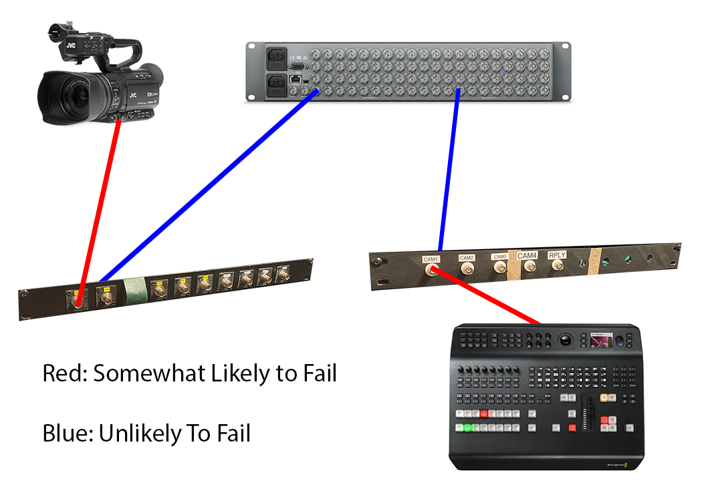

Troubleshooting
===============

Connections and Cables - Physical
---------------------------------

### “Nothing is showing up!”

Let’s say you’re setting up at a stream, you turn on the switcher, have the multicam view pulled up, your cameras are plugged into MOAC—but you see nothing. Where do you start?

*   Identify the exact issue—what isn’t working, and how should it work
    *   If you don’t know how it should work, use the guide! For instance, here it would be beneficial to look over [Setting Up -> Cables and Connections](h.saa8t5379qfj#cables-and-connections) in the MOAC section.
*   Think of what needs to go right for it to work
*   Change ONE thing at a time, switching out things that you think may not work

So, in practice:  
In your mind (and this is something that gets much easier with time as you get more familiar with our setup) create a “diagram” of all of the things that need to go right to see video.

It can also help to “label” how likely something is to fail. Something that’s stable for a long time can usually be trusted, but the random SDI you grabbed from the bin may very well be damaged. For this example, you’d need:

*   The camera must be on and sending a signal
*   The connection from the camera to the hub must be working
    *   Connection from the camera to the input patch panel (decent chance to fail)
    *   Connection from input patch panel to the hub (unlikely to fail)
*   The connection from the hub to the switcher must be working
    *   Connection from hub to output patch panel (unlikely to fail)
    *   Connection from output patch panel to the hub (decent chance to fail)

And, a more “graphical” approach:

To bring this into the real world:

Start with the cables most likely to fail/not be connected. First, make sure they are connected—and securely! You should be able to trace a video signal from its origin to its destination in your mind, and make sure that that chain is unbroken. To do this, you just have to become familiar with the setup (or use the [relevant guide section](h.saa8t5379qfj#cables-and-connections), but it becomes much easier when you know what's going on already).

Then, start with the cables most likely to fail. Is one frail/frayed? Change it, and only it, and see if it fixes the problem.

It’s very important to change only one thing at a time. Troubleshooting is a science, and as with any good science you should only be changing one variable. This way, you can what actually broke, and take steps to prevent future issues (throwing away a bad cable or connector, cleaning a connector, etc.).

Eventually, you will have separated the things that you know for sure work, and the things you either don’t know or know don’t work. Swap those things out!